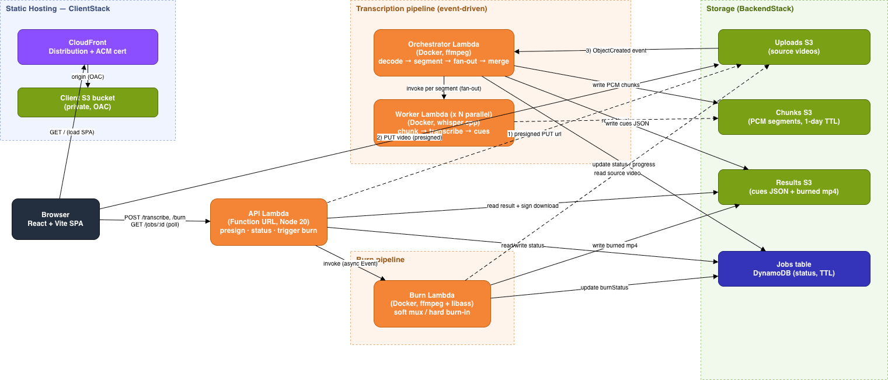

# Caption Studio

Upload a video, get accurate subtitles, edit them in the browser, and download the
video with captions baked in; or as a separate subtitle track.

Transcription runs on a serverless AWS pipeline: the audio is split into segments and
transcribed in parallel with whisper.cpp, so a long video finishes about as fast as a
short one. Captions can then be styled and burned into the video with ffmpeg.

## How it works

1. The React SPA (served from CloudFront + S3) asks the API for a presigned URL and
   uploads the video straight to S3.
2. The upload fires an S3 event that wakes the **orchestrator** Lambda, which decodes
   the audio, chops it into segments, and fans out one **worker** Lambda per segment.
3. Workers transcribe their chunk with whisper.cpp; the orchestrator merges the cues
   into SRT/VTT and saves them. Job status lives in DynamoDB; the client polls for it.
4. After editing, the client posts the subtitles to the **burn** Lambda, which uses
   ffmpeg to mux a soft subtitle track or hard-burn styled captions into the video.

## Architecture

The editable source is in [`docs/architecture.drawio`](docs/architecture.drawio).

## Project layout

| Path       | What it is                                                        |
| ---------- | ----------------------------------------------------------------- |
| `client/`  | React + Vite single-page app (upload, edit, preview, export)      |
| `backend/` | NestJS code + Lambda handlers (`api`, `orchestrator`, `worker`, `burn`) |
| `infra/`   | AWS CDK stacks (hosting, certificate, backend resources)          |
| `docs/`    | Architecture diagram and migration notes                          |
